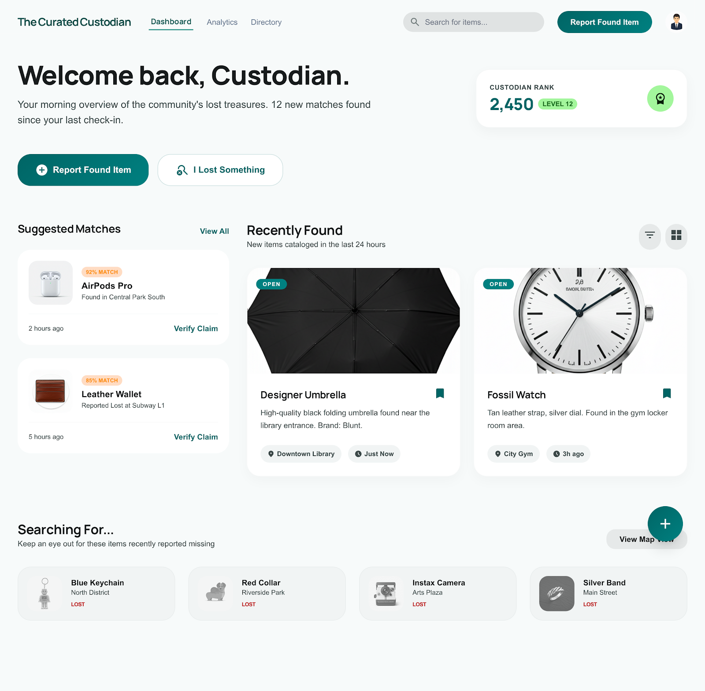
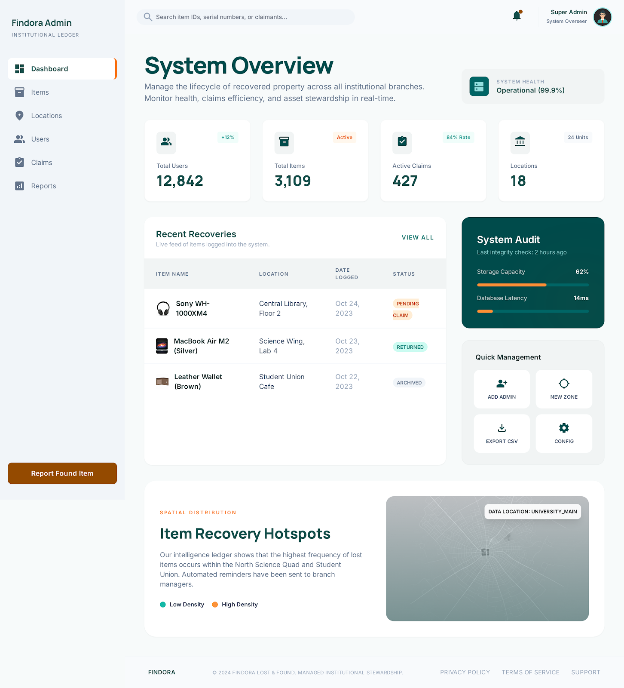
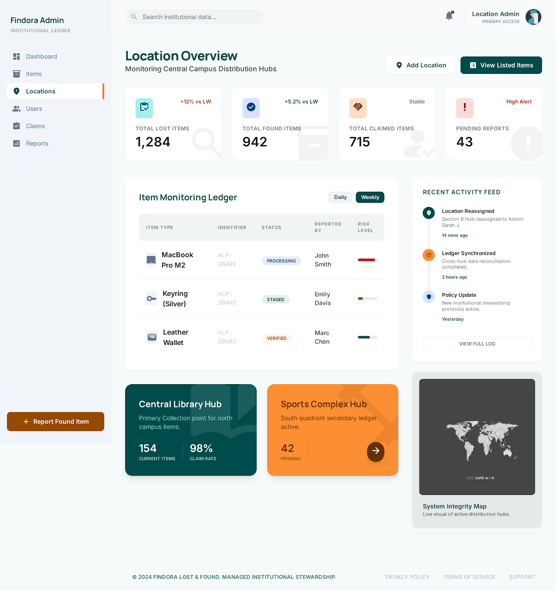

# Findora

## Institutional Lost & Found, Reimagined

Findora is a ready-to-launch lost-and-found platform built for institutions that need more than a static bulletin board. It connects lost item reports, found item intake, location-level custody, and claim verification into one polished web experience.



## What Makes Findora Unique

- **Institutional workflow built in**: separate dashboards for global admins, location admins, and public users.
- **Claim verification first**: claimants submit proofs, identifiers, and evidence through a secure workflow instead of guesswork.
- **Location-led item management**: every item is tagged to a physical location and managed through a dedicated location ledger.
- **Modern UI for a legacy stack**: clean Tailwind-inspired pages and responsive layout on a Jakarta Servlet / JSP foundation.
- **Secure account model**: JWT-backed user sessions, bcrypt password hashing, and role-based access control.
- **Real-world readiness**: item moderation, status tracking, and audit-friendly workflows are built into the system.

## The Problem

Many campuses, airports, retail centers, and hospitality operations still manage lost property with spreadsheets, sticky notes, or disconnected tools. That creates friction, liability, and slow reunions. Findora turns that process into a reliable, transparent, and brand-ready service.

## The Solution

Findora helps organizations:

- report and catalog lost items quickly
- register found items with photos, location context, and ownership details
- route claims to the right location and verify ownership responsibly
- empower location admins to manage inventory and close cases
- centralize the entire lifecycle from reporting to return or disposition


## Core Features

- **Public item discovery**: browse lost and found listings with category and location filters.
- **Found-item intake**: structured forms for capturing item details, photos, and discovery location.
- **Lost-item reporting**: let users report missing property and match it against found inventory.
- **Claim submission**: secure claims with proof upload and legal acknowledgement.
- **Location admin portal**: assign, manage, and resolve items by property or room.
- **Global admin console**: review claims, moderate inventory, and keep operations compliant.

## Why Investors Should Care

Findora is not just another marketplace; it is a process automation platform for a high-cost, low-visibility problem. Lost property leads to operational waste, customer frustration, and liability. A dedicated platform like Findora can dramatically reduce recovery times, increase trust, and create a new premium service layer for institutions.



## Tech Snapshot

- Java 23
- Jakarta Servlet API 6.1
- JSP + JSTL front-end
- Maven build (`war` packaging)
- MySQL / MariaDB persistence
- `jbcrypt` for password security
- `java-jwt` for authentication tokens

## Quick Start

```bash
cd landf
./mvnw package
```

Deploy the generated WAR to any Jakarta EE-compatible application server and configure a MySQL/MariaDB data source.

## Product Vision

Findora is positioned to become the preferred operations platform for:

- university lost and found centers
- transit hubs and airports
- hotel and event venue property teams
- retail and logistics recovery desks
- corporate campus facilities

It combines a clear problem domain with a strong user story: reunite lost property faster, with better verification, and less administrative overhead.



## Where to Look Next

- `landf/pom.xml` – project dependencies and build setup
- `landf/src/main/java/com/landf` – core Java application logic
- `landf/src/main/webapp` – JSP views, dashboards, and public workflows
- `landf/src/main/webapp/WEB-INF/web.xml` – deployment configuration

---

Findora is a polished operational product with a clear value proposition: make lost property recovery efficient, auditable, and scalable.
